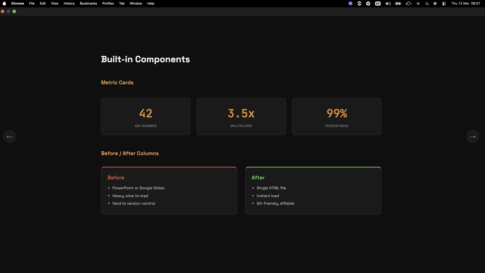

# Tech Slides

A lightweight, zero-dependency HTML presentation framework with keyboard navigation, slide transitions, and fullscreen mode.

**[Live Demo](https://csantos31.github.io/tech-slides/)**



## Features

- **Zero dependencies** — just HTML + CSS + vanilla JS
- **Keyboard navigation** — arrow keys or spacebar
- **Click navigation** — visible arrow buttons on screen
- **Fullscreen mode** — built-in button (works in VDI/remote desktops where F11 doesn't)
- **Progress bar** — animated gradient bar at the top
- **Staggered animations** — elements fade in sequentially on slide entry
- **Dark theme** — Space Grotesk + JetBrains Mono typography
- **Responsive** — works on desktop, tablet, and mobile
- **Git-friendly** — plain HTML, easy to diff and version

## Built-in Components

| Component | Class | Usage |
|---|---|---|
| Metric cards | `.metrics-grid` > `.metric-card` | Big numbers with labels |
| Before/After columns | `.before-after` > `.ba-col.before` / `.ba-col.after` | Side-by-side comparison |
| Architecture flows | `.arch-flow` | Monospace text with colored highlights |
| Status tags | `.tag.tag-done` / `.tag-progress` / `.tag-accent` / `.tag-phase2` | Inline status badges |
| Tables | Standard `<table>` | Styled with dark header and hover |
| Code | `<code>` | Inline monospace with background |

## Quick Start

```bash
git clone https://github.com/csantos31/tech-slides.git
cd tech-slides
open index.html
```

Edit `index.html` to add your slides. Each slide is a `<div class="slide">` with a `data-slide` attribute (0-indexed).

## Creating a Slide

```html
<div class="slide" data-slide="0">
    <span class="slide-number">01 / 05</span>
    <h2 class="animate-in delay-1">Slide Title</h2>
    <p class="animate-in delay-2">Content with staggered animation</p>
</div>
```

## Animation Classes

Add `animate-in` + `delay-N` to stagger element entrance:

```html
<h2 class="animate-in delay-1">Appears first</h2>
<p class="animate-in delay-2">Appears second</p>
<div class="animate-in delay-3">Appears third</div>
```

## Customization

Edit CSS variables in `tech-slides.css`:

```css
:root {
    --accent: #f56e0f;    /* primary color */
    --accent2: #ff9a44;   /* gradient end */
    --green: #22c55e;     /* success */
    --red: #ef4444;       /* danger */
    --bg: #0f0f0f;        /* background */
}
```

## License

MIT
